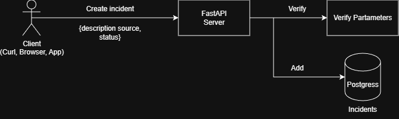
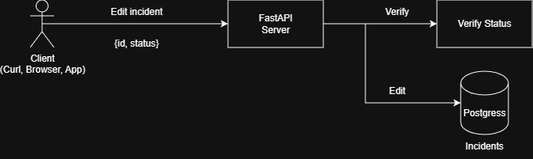
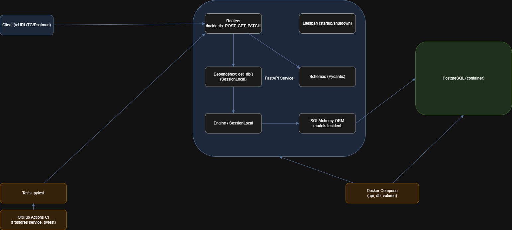

# UCAR<>TOPDUER — Тестовое задание

**Задача**: сделать маленький API-сервис для учёта инцидентов.

**Контекст**: операторы и системы присылают сообщения о проблемах в TG (самокат не в сети, точка не отвечает, отчёт не выгрузился). 

- **Создать инцидент**
- **Получить список инцидентов (с фильтром по статусу)**
- **Обновить статус инцидента по id**

## GitHub actions:
Статус последнего выполненного теста: 

[Ссылка на GitHub Actions](https://github.com/4rut/ucar-test-task/actions)

## Быстрый старт
Запуск через Docker    
   ```bash
   docker compose up --build 
   ```

## API
FastAPI swagger будет доступен по ссылке:
http://localhost:8000/docs/

- Status: `OPEN`, `ACKNOWLEDGED`, `IN_PROGRESS`, `RESOLVED`, `CLOSED`.
- Source: `OPERATOR`, `MONITORING`, `PARTNER`.

### Создать инцидент

```bash
curl -X POST http://localhost:8000/incidents -H "Content-Type: application/json" -d '{"description":"Scooter #42 offline","source":"OPERATOR", "status":"OPEN"}'
```

### Список инцидентов (все/по статусу)

Все инциденты
```bash
curl "http://localhost:8000/incidents"
```

С необходимым статусом
```bash
curl "http://localhost:8000/incidents?status=OPEN"
```

### Обновление статуса инцидента


```bash
curl -X PATCH http://localhost:8000/incidents/1/status -H "Content-Type: application/json" -d '{"status":"RESOLVED"}'
```

## Структура проекта

```
app/
  api/
    deps.py
    routes/
      incidents.py
  core/
    config.py
  db/
    session.py
  models/
    incident.py
  schemas/
    incident.py
  main.py
tests/
  test_incidents.py
.dockerignore
Dockerfile
docker-compose.yml
requirements.txt
.github/workflows/ci.yml
.env.example
```
